# OpenSearch Extensions for Rust

*Note*: This document describes the design and architecture of the OpenSearch Rust SDK for building extensions.

## Overview

The OpenSearch Rust SDK enables developers to build extensions that run as separate processes, communicating with OpenSearch through a high-performance transport protocol. This architecture provides better isolation, security, and reliability compared to traditional plugins while leveraging Rust's memory safety and performance characteristics.

## Why Rust for Extensions?

- **Memory Safety**: Rust's ownership system prevents common bugs like null pointer dereferences and data races
- **Performance**: Zero-cost abstractions and no garbage collector ensure predictable performance
- **Concurrency**: Built-in async/await support with tokio for efficient I/O operations
- **Type Safety**: Strong type system catches errors at compile time
- **Ecosystem**: Rich ecosystem of libraries for networking, serialization, and web services

## Architecture Overview

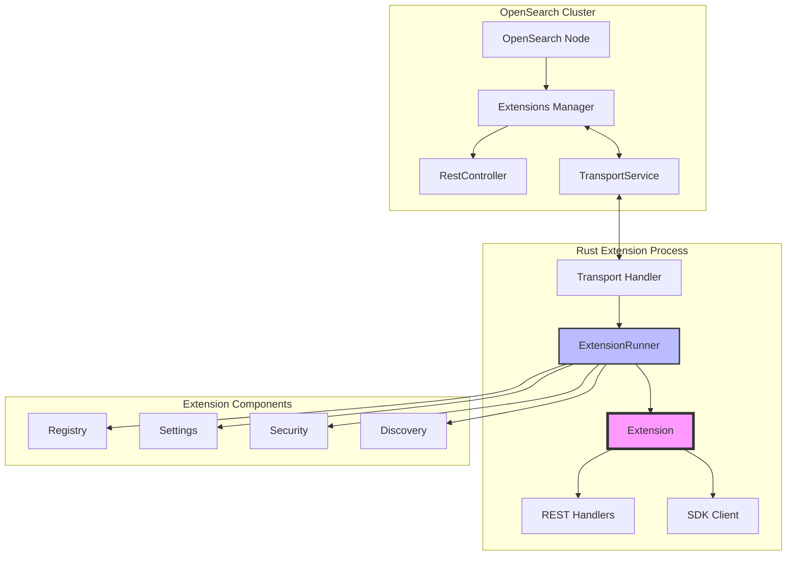

## Core Components

### Extension Trait

The foundation of every Rust extension is the `Extension` trait:

```rust
#[async_trait]
pub trait Extension: Send + Sync + 'static {
    /// Extension name
    fn name(&self) -> &str;
    
    /// Unique identifier
    fn unique_id(&self) -> &str;
    
    /// Extension version
    fn version(&self) -> &str;
    
    /// Initialize the extension
    async fn initialize(&mut self, context: ExtensionContext) -> Result<(), ExtensionError>;
    
    /// Register REST handlers
    fn rest_handlers(&self) -> Vec<Box<dyn RestHandler>>;
    
    /// Register transport actions
    fn transport_actions(&self) -> Vec<Box<dyn TransportAction>>;
}
```

### Extension Lifecycle

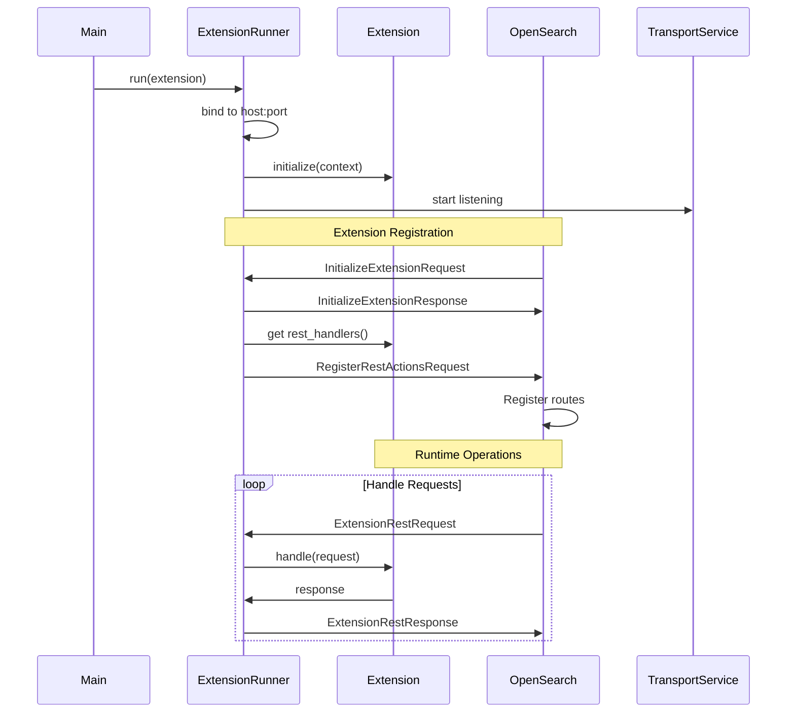

## Transport Protocol Implementation

The Rust SDK implements the OpenSearch transport protocol for efficient binary communication:

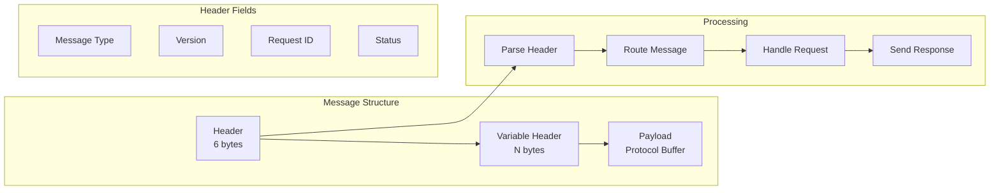

### Transport Message Flow

```rust
// Incoming message handling
pub async fn handle_connection(stream: TcpStream) {
    let (reader, writer) = stream.split();
    
    loop {
        // 1. Read and parse header
        let header = read_header(&mut reader).await?;
        
        // 2. Route based on message type
        match header.message_type {
            MessageType::Request => {
                let action = read_action(&mut reader).await?;
                let handler = find_handler(&action)?;
                
                // 3. Process request
                let response = handler.handle(reader).await?;
                
                // 4. Send response
                send_response(writer, header.request_id, response).await?;
            }
            MessageType::Response => {
                // Handle response for pending request
                handle_response(header, reader).await?;
            }
        }
    }
}
```

## REST Action Registration and Handling

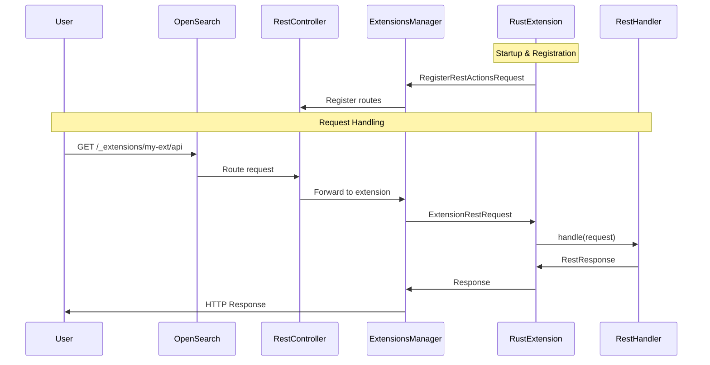

### REST Handler Implementation

```rust
use async_trait::async_trait;
use std::borrow::Cow;

#[async_trait]
pub trait RestHandler: Send + Sync {
    /// HTTP methods this handler supports
    fn methods(&self) -> Cow<'static, [Method]>;
    
    /// Path pattern (e.g., "/users/{id}")
    fn path(&self) -> &str;
    
    /// Handle the request
    async fn handle(&self, request: RestRequest) -> Result<RestResponse, RestError>;
}

// Example implementation
struct UserHandler;

#[async_trait]
impl RestHandler for UserHandler {
    fn methods(&self) -> Cow<'static, [Method]> {
        Cow::Owned(vec![Method::GET, Method::POST])
    }
    
    fn path(&self) -> &str {
        "/users/{id}"
    }
    
    async fn handle(&self, request: RestRequest) -> Result<RestResponse, RestError> {
        match request.method {
            Method::GET => {
                let id = request.path_params.get("id").unwrap();
                // Fetch user logic
                RestResponse::json(user)
            }
            Method::POST => {
                let user: User = request.json()?;
                // Create user logic
                RestResponse::created(user)
            }
            _ => unreachable!()
        }
    }
}
```

## Extension Point Implementation

The Rust SDK provides various extension points similar to the Java SDK:

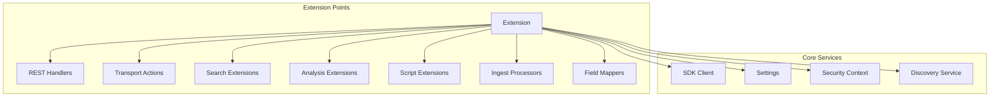

### Named XContent Registration Example

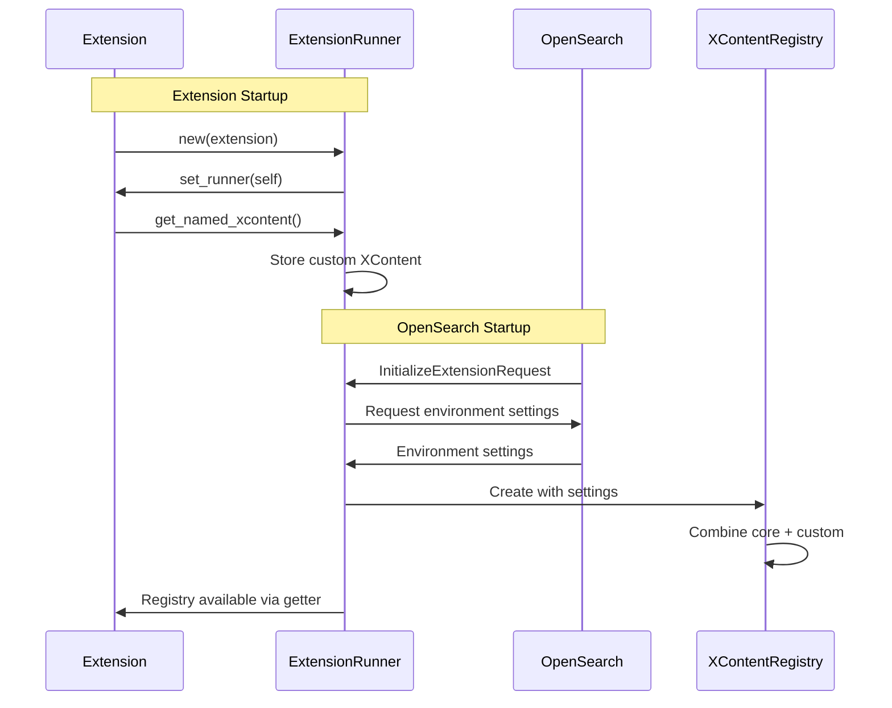

## Security Architecture

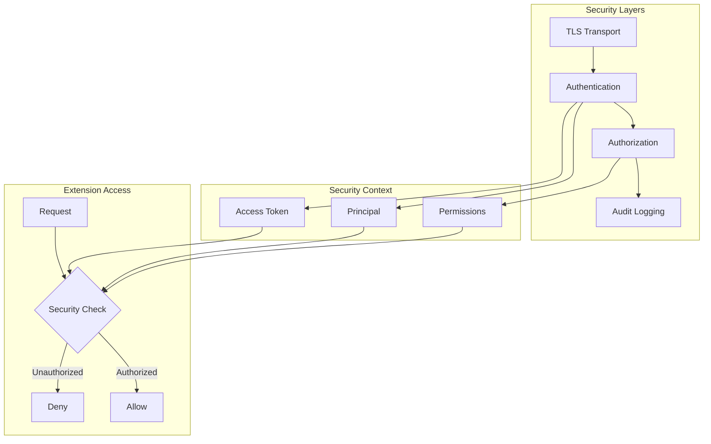

## Service Discovery and Communication

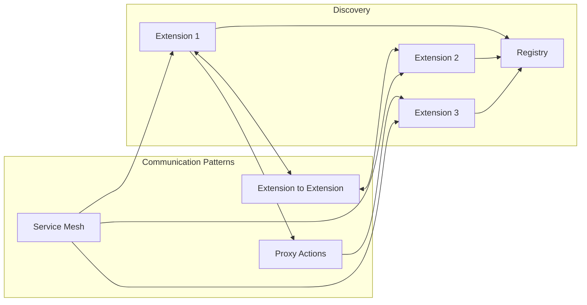

### Extension-to-Extension Communication

```rust
// Proxy action for remote execution
pub async fn call_remote_extension(
    client: &SDKClient,
    target_extension: &str,
    action: &str,
    request: impl Serialize,
) -> Result<impl DeserializeOwned, Error> {
    let proxy_request = ProxyActionRequest {
        target_extension: target_extension.to_string(),
        action: action.to_string(),
        request: serde_json::to_value(request)?,
    };
    
    client.execute_action("proxy", proxy_request).await
}
```

## Performance Optimizations

The Rust SDK is designed for high performance:

1. **Zero-copy parsing**: Using `nom` for efficient protocol parsing
2. **Connection pooling**: Reusing TCP connections
3. **Async I/O**: Non-blocking operations with `tokio`
4. **Lock-free data structures**: For hot paths
5. **SIMD optimizations**: For data processing

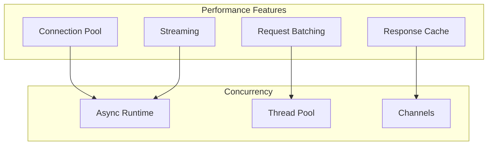

## Development Workflow

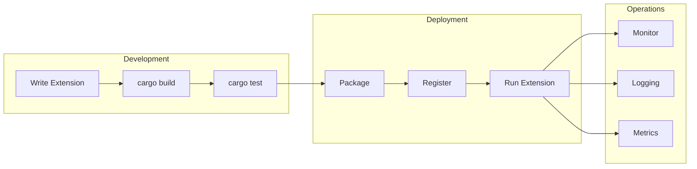

### Quick Start Example

```rust
use opensearch_sdk::prelude::*;

#[derive(Default)]
struct HelloWorldExtension;

#[async_trait]
impl Extension for HelloWorldExtension {
    fn name(&self) -> &str {
        "hello-world"
    }
    
    fn unique_id(&self) -> &str {
        "hello-world-rust"
    }
    
    fn version(&self) -> &str {
        "1.0.0"
    }
    
    async fn initialize(&mut self, _context: ExtensionContext) -> Result<(), ExtensionError> {
        println!("Hello World Extension initialized!");
        Ok(())
    }
    
    fn rest_handlers(&self) -> Vec<Box<dyn RestHandler>> {
        vec![Box::new(HelloHandler)]
    }
}

struct HelloHandler;

#[async_trait]
impl RestHandler for HelloHandler {
    fn methods(&self) -> &[Method] {
        &[Method::GET]
    }
    
    fn path(&self) -> &str {
        "/hello"
    }
    
    async fn handle(&self, _request: RestRequest) -> Result<RestResponse, RestError> {
        RestResponse::json(json!({
            "message": "Hello from Rust Extension!"
        }))
    }
}

#[tokio::main]
async fn main() -> Result<(), Box<dyn std::error::Error>> {
    let extension = HelloWorldExtension::default();
    ExtensionRunner::run(extension).await
}
```

## Testing Framework

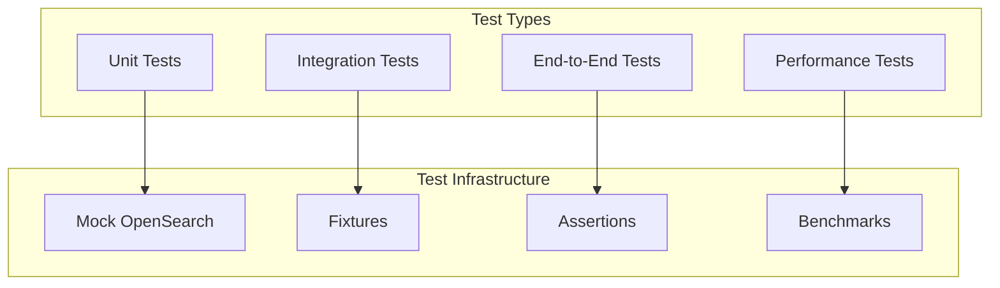

## Migration from Java/Python

For teams migrating from Java or Python SDKs:

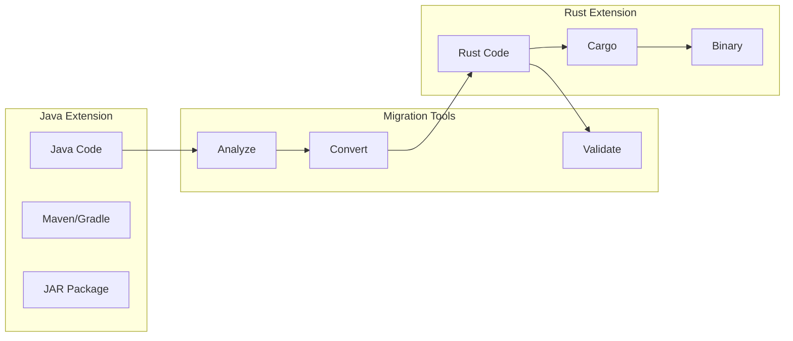

## Comparison with Plugin Architecture

| Feature | Plugins | Rust Extensions |
|---------|---------|-----------------|
| Process Isolation | Same process | Separate process |
| Memory Safety | JVM overhead | Rust guarantees |
| Failure Impact | Can crash cluster | Isolated failures |
| Resource Control | Shared resources | Independent limits |
| Security | Full access | Sandboxed |
| Deployment | Restart required | Hot deployment |
| Performance | Direct calls | Optimized transport |

## FAQ

**Q: What are the performance implications of using Rust extensions?**
A: Rust extensions have minimal overhead due to:
- Efficient binary transport protocol
- Zero-copy message parsing
- No garbage collection pauses
- Predictable memory usage
- Async I/O for high concurrency

**Q: Can Rust extensions communicate with Java/Python extensions?**
A: Yes, all extensions use the same transport protocol, enabling cross-language communication through proxy actions.

**Q: What OpenSearch versions are supported?**
A: The Rust SDK supports OpenSearch 2.x and above, with wire compatibility across minor versions.

**Q: How do I debug Rust extensions?**
A: The SDK provides:
- Structured logging with `tracing`
- Remote debugging support
- Metrics and telemetry
- Integration with OpenSearch's monitoring

**Q: What's the deployment model for Rust extensions?**
A: Rust extensions compile to single binary executables that can be:
- Deployed on the same node as OpenSearch
- Run on separate nodes for better isolation
- Containerized for cloud deployments
- Managed by orchestration systems

## Next Steps

1. Review the [Developer Guide](DEVELOPER_GUIDE.md) for detailed setup instructions
2. Explore the [example extensions](examples/) for common patterns
3. Check the [API documentation](https://docs.rs/opensearch-sdk) for comprehensive reference
4. Join the [community forums](https://forum.opensearch.org) for support

## Contributing

We welcome contributions! Please see our [Contributing Guidelines](CONTRIBUTING.md) for details on:
- Code style and standards
- Testing requirements
- Documentation guidelines
- Pull request process

## License

This project is licensed under the Apache License 2.0 - see the [LICENSE](LICENSE.txt) file for details.