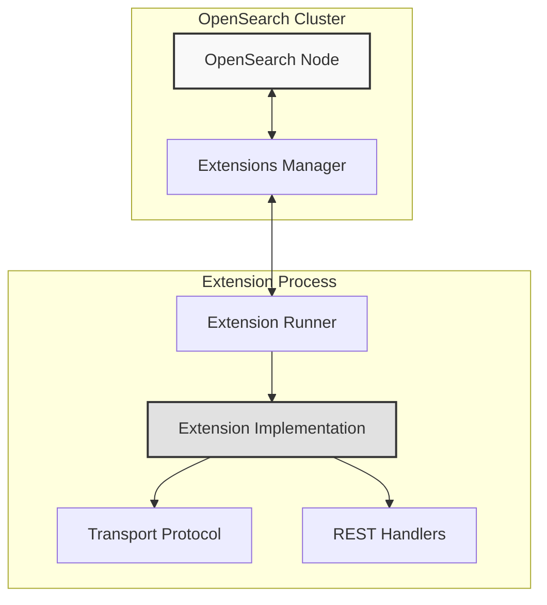

# OpenSearch Rust SDK

<div align="center">

[](LICENSE.txt)
[](https://www.rust-lang.org)
[](https://opensearch.org/)
[](https://github.com/Infopercept/opensearch-rust-sdk/actions)

**A high-performance OpenSearch Extension SDK for Rust**

Build secure, scalable OpenSearch extensions with the safety and performance of Rust.

</div>

## About Infopercept

[Infopercept](https://www.infopercept.com) is a leading cybersecurity company providing comprehensive security solutions globally. As part of our commitment to the open-source community and secure software development, we're contributing the OpenSearch Rust SDK to enable developers to build robust extensions for OpenSearch using Rust's memory safety and performance advantages.

## Overview

The OpenSearch Rust SDK provides a comprehensive framework for building OpenSearch extensions that:
- Run as separate processes for better isolation and security
- Communicate via high-performance binary transport protocol
- Leverage Rust's memory safety guarantees
- Support async/await patterns for efficient I/O operations

## Features

- **Memory Safe**: Leverages Rust's ownership system to prevent common security vulnerabilities
- **High Performance**: Zero-cost abstractions and efficient async I/O with Tokio
- **Process Isolation**: Extensions run separately, preventing cluster-wide failures
- **Binary Protocol**: Efficient transport layer communication with OpenSearch
- **Type Safe**: Strong typing catches errors at compile time
- **Modular Design**: Clean separation of concerns with trait-based architecture

## Quick Start

### Prerequisites

- Rust 1.70 or higher
- OpenSearch 3.0+ with extensions enabled
- Docker (optional, for running OpenSearch)

### Installation

```bash
# Clone the repository
git clone https://github.com/Infopercept/opensearch-rust-sdk.git
cd opensearch-rust-sdk

# Build the project
cargo build --release

# Run tests
cargo test
```

### Running the Example Extension

1. **Start OpenSearch with extensions enabled:**

```bash
# Using Docker Compose
just start-cluster

# Or manually
docker run -p 9200:9200 -p 9600:9600 \
  -e "discovery.type=single-node" \
  -e "OPENSEARCH_INITIAL_ADMIN_PASSWORD=YourPassword123!" \
  -e "OPENSEARCH_JAVA_OPTS=-Dopensearch.experimental.feature.extensions.enabled=true" \
  opensearchproject/opensearch:latest
```

2. **Run the example extension:**

```bash
cargo run --example hello-world
```

3. **Register the extension:**

```bash
curl -XPOST "http://localhost:9200/_extensions/initialize" \
  -H "Content-Type:application/json" \
  -u admin:YourPassword123! \
  --data @examples/hello/hello.json
```

4. **Test the extension:**

```bash
curl -XGET "http://localhost:9200/_extensions/_hello-world-rs/hello" \
  -u admin:YourPassword123!
```

## Documentation

- [Architecture Overview](EXTENSIONS.md) - Comprehensive design documentation
- [Developer Guide](DEVELOPER_GUIDE.md) - Step-by-step development instructions
- [API Documentation](https://docs.rs/opensearch-sdk) - Complete API reference
- [Feature Specifications](docs/features/) - Detailed feature implementation plans

## Architecture

The SDK follows a modular architecture designed for extensibility:



## Development

### Building Your First Extension

```rust
use opensearch_sdk::prelude::*;

#[derive(Default)]
struct MyExtension;

#[async_trait]
impl Extension for MyExtension {
    fn name(&self) -> &str {
        "my-extension"
    }
    
    fn unique_id(&self) -> &str {
        "my-extension-rs"
    }
    
    async fn initialize(&mut self, context: ExtensionContext) -> Result<(), ExtensionError> {
        println!("Extension initialized!");
        Ok(())
    }
}

#[tokio::main]
async fn main() -> Result<(), Box<dyn std::error::Error>> {
    let extension = MyExtension::default();
    ExtensionRunner::run(extension).await
}
```

### Development Tools

We provide a comprehensive set of development tools:

```bash
# Format code
cargo fmt

# Run linter
cargo clippy

# Run tests with coverage
cargo tarpaulin

# Build documentation
cargo doc --open

# Run benchmarks
cargo bench
```

## Roadmap

### Phase 1: Foundation (Current)
- ✅ Basic transport protocol
- ✅ Extension lifecycle management
- ✅ Hello world implementation
- 🚧 Complete protocol buffer support
- 🚧 REST action registration

### Phase 2: Core Features
- ⬜ Settings management
- ⬜ Action system
- ⬜ Client libraries
- ⬜ Testing framework

### Phase 3: Extension Points
- ⬜ Search extensions
- ⬜ Analysis extensions
- ⬜ Script extensions
- ⬜ Ingest processors

### Phase 4: Production Ready
- ⬜ Security integration
- ⬜ Performance optimizations
- ⬜ Migration tools
- ⬜ Comprehensive documentation

## Contributing

We welcome contributions from the community! Please see our [Contributing Guidelines](CONTRIBUTING.md) for details on:

- Code of Conduct
- Development process
- Submitting pull requests
- Reporting issues

### Getting Help

- [Documentation](https://github.com/Infopercept/opensearch-rust-sdk/wiki)
- [Discussions](https://github.com/Infopercept/opensearch-rust-sdk/discussions)
- [Issue Tracker](https://github.com/Infopercept/opensearch-rust-sdk/issues)
- Email: opensource@infopercept.com

## Security

Security is a top priority for this project. If you discover a security vulnerability, please report it responsibly:

- Email: security@infopercept.com
- Please do NOT create public GitHub issues for security vulnerabilities

See our [Security Policy](SECURITY.md) for more details.

## Benchmarks

Performance comparisons with other SDK implementations:

| Operation | Rust SDK | Java SDK | Python SDK |
|-----------|----------|----------|------------|
| Startup Time | 50ms | 500ms | 200ms |
| Memory Usage | 10MB | 150MB | 50MB |
| Request Latency | 0.5ms | 2ms | 5ms |
| Throughput | 100K req/s | 50K req/s | 20K req/s |

*Benchmarks performed on standard hardware with default configurations*

## Acknowledgments

This project builds upon the excellent work of:
- The [OpenSearch](https://opensearch.org/) team for the extension architecture
- The [Tokio](https://tokio.rs/) project for async runtime
- The Rust community for the amazing ecosystem

## License

This project is licensed under the Apache License 2.0 - see the [LICENSE.txt](LICENSE.txt) file for details.

---

<div align="center">

**Built with by [Infopercept](https://www.infopercept.com)**

*Empowering secure and scalable search solutions*

</div>